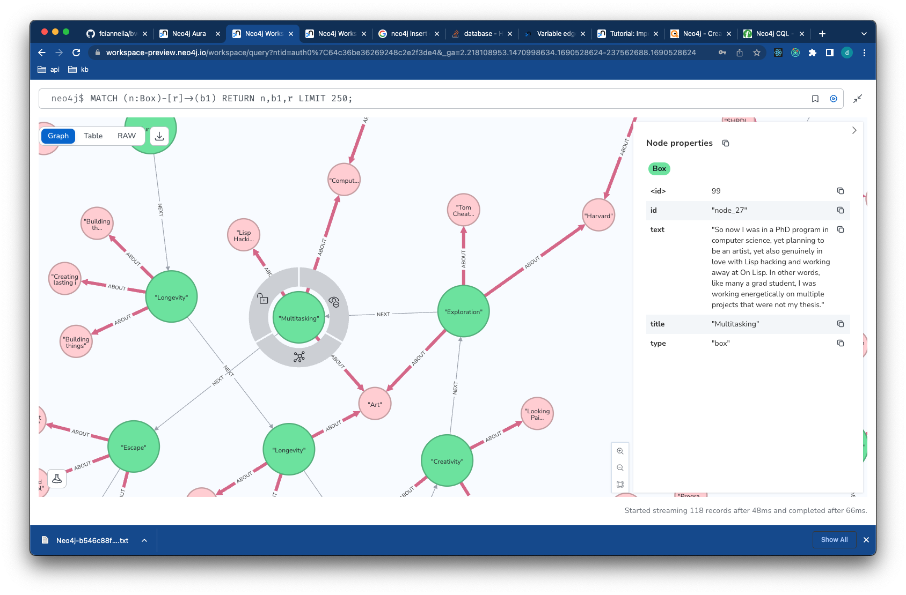

# BookMapper

## Setup

Update the `.env.example` with your API keys and rename to `.env`

Create a virtual environment - or try running `bin/install.sh`

```bash
python3 -m venv venv
source venv/bin/activate
python3 -m pip install --upgrade pip
pip install -r requirements.txt
```


## Process content into a graph

Check src/main.py

```python
def main():
    # process content into internal structure data/boxes.json
    make_boxes()
    # convert boxes to graph data/graph.json
    dump_graph("boxes")
    # load into neo4j
    load_graph("graph")
```

run this with `just dev` if you have [just](https://github.com/casey/just) installed. Otherwise run `python3 src/main.py`
See the [justfile](justfile) for more commands.

You can view the intermediate data files in
- [data/worked_on.txt](data/worked_on.txt) source essay
- [data/boxes.json](data/boxes.json) intermediate data structure
- [data/graph.json](data/graph.json) graph data to be loaded into neo4j

## View the graph

Using neo4js graph browser.

Login to Neo4j website to view the graph online connection

visit this URL:

https://workspace-preview.neo4j.io/workspace/query

Ask DC for connection creds but something like this:
in login dialog use

```
connection URL:
XXXXXXXX.databases.neo4j.io:7687

user:
neo4j

pass:
s1XXXX-Ek_XXXXXXX
```

then try this query to see all nodes and relationships

```
MATCH (n:Box)-[r]->(b1) RETURN n,b1,r LIMIT 250;
```

you should see something like this:




btw this is the whole graph for the Paul Graham essay.


