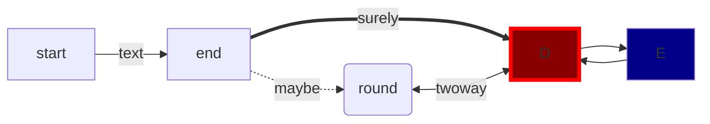
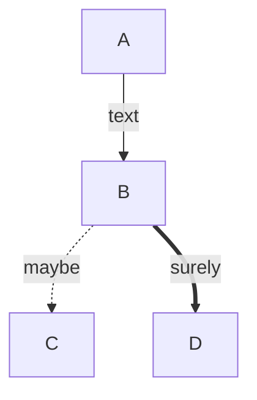
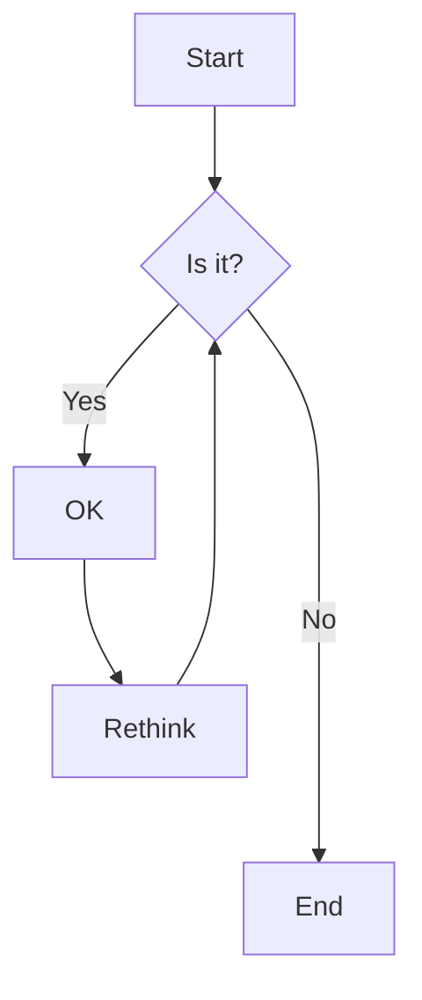
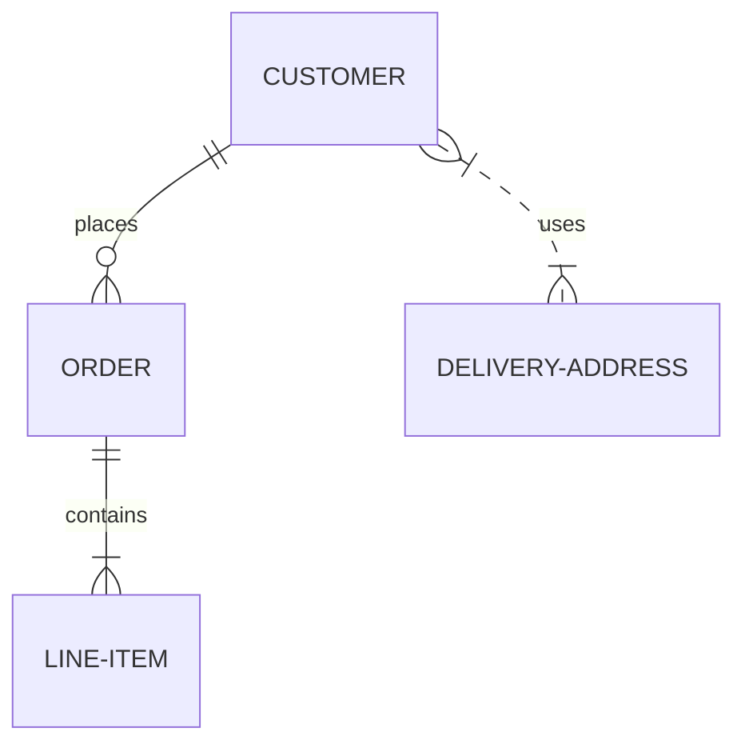
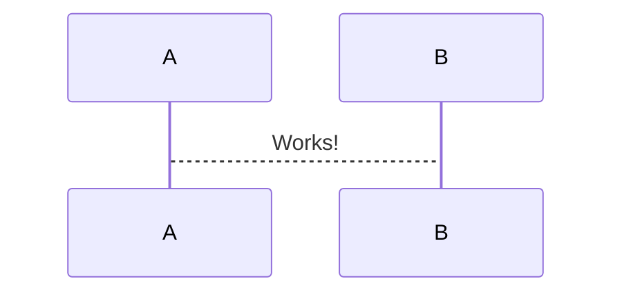

test doc

```mermaid
flowchart LR
    A[start] -->| text |B[end]
    B -. maybe .->C(round)
    B == surely ==> D
    C <-- twoway --> D
    D --> E
    E:::blue --> D
    style D fill:#800,stroke:#F00,stroke-width:4px
    classDef blue fill:#008
```

```mermaid
flowchart TD
    A -->| text |B
    B -. maybe .->C
    B == surely ==> D
```

```mermaid
flowchart TD
    A[Start] --> B{Is it?}
    B -- Yes --> C[OK]
    C --> D[Rethink]
    D --> B
    B -- No ----> E[End]
```

```mermaid
erDiagram
    CUSTOMER ||--o{ ORDER : places
    ORDER ||--|{ LINE-ITEM : contains
    CUSTOMER }|..|{ DELIVERY-ADDRESS : uses
```

```mermaid
sequenceDiagram
  A-->B: Works!
```

sequenceDiagram A-->B: Works!

